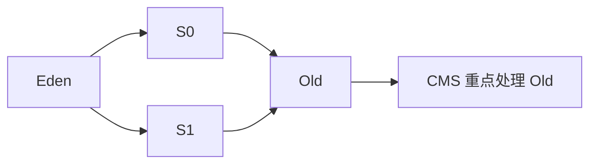
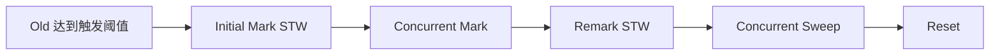
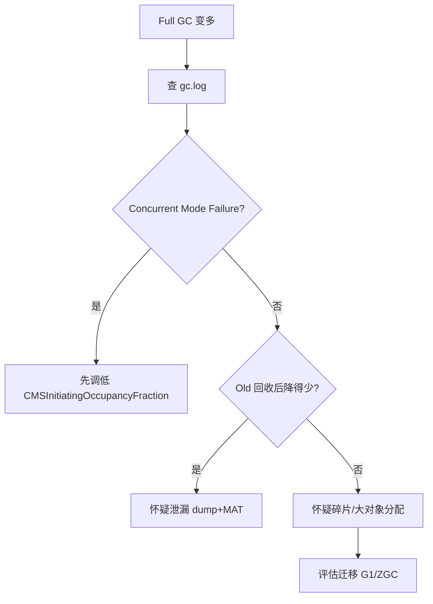
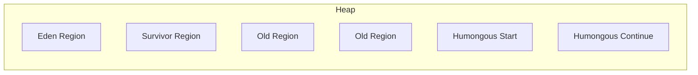
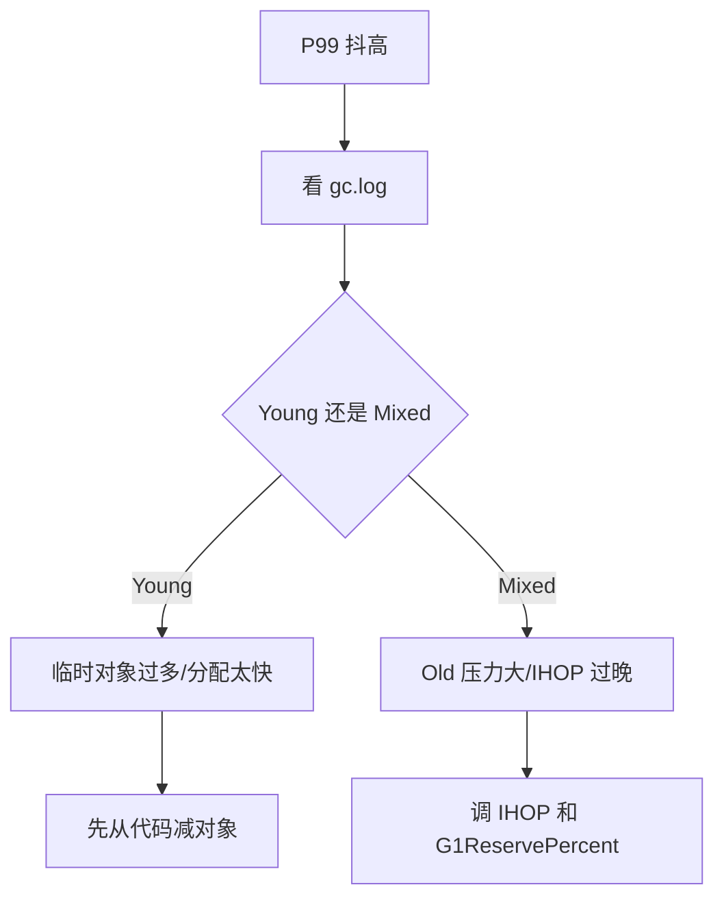
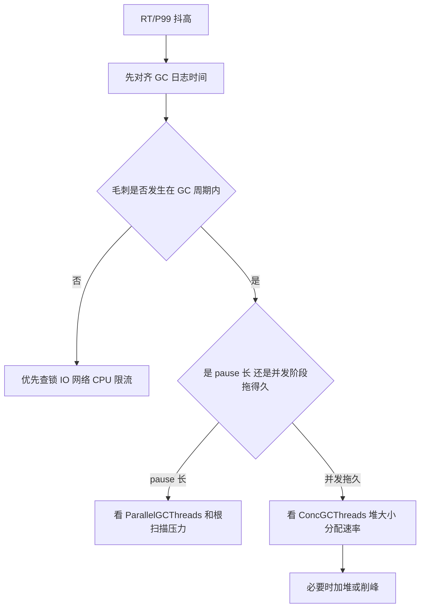

# jvm

## JVM 内存结构

线程私有区域

- **程序计数器（Program Counter Register）**
- **虚拟机栈（Java Virtual Machine Stack）**
- **本地方法栈（Native Method Stack）**

特点：

- 每个线程独有
- 生命周期和线程一致
- 不存在数据共享问题

***

2️⃣ 线程共享区域

- **堆（Heap）**
- **方法区（Method Area）**
  - 在 JDK 8 之后由 **元空间（Metaspace）** 实现

## Java 对象在 JVM 中是如何创建的？

Java 对象创建主要分为七步：\
类加载检查 → 堆内存分配 → 并发安全处理（CAS 或 TLAB） → 内存初始化 → 设置对象头 → 执行构造方法 → 返回对象引用。

一、对象创建的触发

Java 对象的创建通常是通过 `**new**`\*\* 关键字\*\*触发，例如：

```plain
User user = new User();
```

当 JVM 执行到 `new` 指令时，就会开始对象创建流程。

***

二、类加载检查

在真正创建对象之前，JVM 会先检查：

- **该类是否已经被加载**
- **是否已经完成类加载、连接、初始化**

如果没有，就会先执行 **类加载过程**：

1. **加载（Loading）**
2. **验证（Verification）**
3. **准备（Preparation）**
4. **解析（Resolution）**
5. **初始化（Initialization）**

如果类已经加载完成，就直接进入下一步。

***

三、为对象分配内存

类加载完成后，JVM 会在 **堆（Heap）** 中为对象分配内存。

分配方式主要有两种：

1️⃣ 指针碰撞（Bump the Pointer）

适用于 **内存规整的堆**（例如使用 **Serial / ParNew GC**）。

原理：

```plain
| 已使用 | 未使用 |
          ↑
        指针
```

创建对象时，只需要把指针向后移动对象大小。

特点：

- 速度快
- 实现简单

***

2️⃣ 空闲列表（Free List）

适用于 **内存不规整的堆**（如 CMS）。

原理：

- JVM 维护一个 **空闲内存列表**
- 从列表中找到合适的空间分配对象

特点：

- 适合碎片化内存

***

四、处理并发安全问题

因为 **多个线程可能同时创建对象**，JVM 需要保证线程安全。

常见两种方式：

1️⃣ CAS + 失败重试

使用 \*\*CAS（Compare And Swap）\*\*保证原子性。

2️⃣ TLAB（Thread Local Allocation Buffer）

每个线程在堆中分配一个 **TLAB 私有区域**：

- 线程优先在 TLAB 中分配对象
- 减少线程竞争

这是 JVM **最常用的优化方式**。

***

五、对象内存初始化

内存分配完成后，JVM 会：

1️⃣ **将对象内存初始化为零值**

例如：

```plain
int -> 0
boolean -> false
reference -> null
```

这样可以保证：

对象字段即使没有显式赋值，也有默认值。

***

六、设置对象头（Object Header）

JVM 会为对象设置 **对象头信息**，包括：

1️⃣ Mark Word

存储运行时数据：

- hashCode
- GC 分代年龄
- 锁状态
- 偏向锁信息

2️⃣ Klass Pointer

指向对象的 **类元数据（Class）**。

JVM 通过它知道：

- 这个对象属于哪个类
- 方法在哪里

***

七、执行对象初始化（构造方法）

最后一步：

执行 `**<init>**`\*\* 构造方法\*\*。

流程：

1. 调用父类构造方法
2. 执行实例变量赋值
3. 执行构造函数代码

例如：

```plain
new User();
```

最终会执行：

```plain
User.<init>()
```

***

八、返回对象引用

对象创建完成后：

- JVM 返回 **对象引用（reference）**
- 赋值给变量

```plain
User user = new User();
```

`user` 保存的是 **对象地址引用**，而不是对象本身。

## JVM 中对象在堆里的 内存布局是什么样的？

在 HotSpot JVM 中，对象在堆中的内存布局主要包括三部分：对象头、实例数据和对齐填充。

对象头主要包含 Mark Word 和类型指针，Mark Word 存储对象运行时数据，比如 hashCode、GC 年龄、锁状态等；类型指针指向类元数据。

实例数据存储对象的成员变量。

最后为了保证对象大小是 8 字节的倍数，JVM 可能会进行对齐填充。

## 对象什么时候会进入 老年代？

1️⃣ 年龄达到晋升阈值    15

2️⃣ 大对象直接进入老年代

3️⃣ Survivor 区放不下    对象会 **提前进入老年代**。

动态对象年龄判定（很多人不知道）

JVM 有一个 **动态年龄机制**。

如果某个年龄段对象总大小：> Survivor 空间一半

> \= 该年龄的对象全部晋升老年代

## 如何破坏双亲委派机制

双亲委派是 **约定的默认行为**（`ClassLoader.loadClass` 会先委派父加载器），要“破坏/绕过”它通常有几种做法：

1. **实现子优先（child-first）/自定义 ClassLoader**：覆盖 `loadClass`，先尝试自己加载（`findClass`/`defineClass`），加载失败再委派。最常见且直接。
2. \*\*直接读取字节并 \*\*`**defineClass**`：不走父委派，直接把 `.class` 字节转换成 `Class`。
3. **改变 JVM 启动参数（bootclasspath / --patch-module 等）**：把自定义类放到 bootstrap 搜索路径前面，从根本上替换核心类。需要 JVM 启动时设置。
4. **使用 Instrumentation / Java Agent**：在运行时通过字节码替换/重定义类（更复杂，受限制）。
5. **使用反射/Unsafe 操作**：操作类加载器内部或方法区（非常危险，不建议）。

### tomcat破坏双亲委派机制

在普通 Java 程序中，**所有类** 都由系统类加载器（`AppClassLoader`）加载。\
但是 Tomcat 不一样：

- Tomcat 是一个 **Web 容器（Web Server）**，
- 它可以同时运行多个 Web 应用（每个 war 包一个独立的应用），
- 不同应用之间要做到：
  - **类相互隔离**（不能相互访问），
  - 但又要**共享一些公共类**（如 Servlet API）。

举例：

```plain
Tomcat 目录结构：
├── bin/          # Tomcat 自己的类
├── lib/          # Tomcat 运行时公共类（如 servlet-api.jar）
├── webapps/
│   ├── app1/WEB-INF/classes/...  # App1 的类
│   ├── app2/WEB-INF/classes/...  # App2 的类
```

👉 目标：

- app1 和 app2 各自的类要 **隔离**。
- 但它们都要能访问 Tomcat 的 servlet API。
- 这就跟默认的 “全局单一类加载器” 机制冲突了

Tomcat 为了实现“每个 Web 应用独立”，\
**部分破坏了双亲委派机制**，采用了一种称为：

🌀 “Child-First”（子优先加载）策略。

也就是说：

当 WebApp 的类加载器加载类时，它会 **先尝试自己加载（WEB-INF 下的类）**，\
如果找不到，才交给父加载器（例如 Tomcat 自己的类、JDK 类）。

但注意：Tomcat 并不是彻底取消父委派，它是 **选择性地破坏**。   为了实现多 Web 应用隔离，但又能共享 Tomcat 公共类。

**Tomcat 破坏双亲委派机制的核心目的**：

- 让每个 Web 应用有独立的类加载空间；
- 防止应用之间相互干扰；
- 同时仍能访问共享的 servlet API；
- 所以选择“子优先加载”模型，而非标准“父优先”。
- <br />

## Minor GC、Major GC、Full GC 的区别。

Minor GC 是发生在新生代的垃圾回收，当 Eden 区满时触发，采用复制算法，速度较快。\
Major GC 是发生在老年代的垃圾回收，由于老年代对象存活率高，所以回收时间较长。\
Full GC 是对整个堆（新生代 + 老年代）以及方法区进行回收，停顿时间最长，对系统影响最大。

## 新生代为什么不用标记整理？

新生代对象的特点是存活率非常低，大部分对象都是朝生夕灭。如果使用标记整理算法，需要扫描和整理整个区域，效率较低。而复制算法只需要复制少量存活对象，其时间复杂度与存活对象数量相关，因此在新生代中效率更高，STW 时间也更短，所以 JVM 在新生代采用复制算法。

## Eden : S0 : S1 为什么是 8 : 1 : 1？

新生代采用 Eden:S0:S1 = 8:1:1 的比例，是为了在使用复制算法时提高内存利用率。如果采用 1:1 的复制结构，会浪费 50% 的空间。而 8:1:1 的结构中，Eden 占 80%，两个 Survivor 各占 10%，Minor GC 时只需要把少量存活对象复制到 Survivor 区即可，因为新生代对象存活率很低，所以 10% 的 Survivor 空间通常足够，从而在保证复制效率的同时减少内存浪费。

## JVM 是如何判断一个对象是否是“垃圾对象”的？也就是说，对象什么时候会被认定为可以回收？

JVM 判断对象是否是垃圾对象主要有两种算法：引用计数法和可达性分析算法。引用计数法通过统计对象的引用次数来判断对象是否可以回收，但它无法解决循环引用问题，因此主流 JVM 并没有采用这种方式。HotSpot JVM 使用的是可达性分析算法，它从 GC Roots 出发，通过引用链搜索对象，如果一个对象无法从 GC Roots 到达，就会被认为是垃圾对象，可以被 GC 回收。

GC Roots 是 **可达性分析的起点**。

主要包括：

栈中的局部变量、静态变量、 常量池引用、JNI 引用

## 有一个机制叫：对象自救（finalize 机制）你讲一下 对象被真正回收前会经历什么过程

当一个对象在可达性分析中被判定为 GC Roots 不可达时，JVM 不会立刻回收，而是会经历两次标记。第一次标记后，JVM 会判断该对象是否需要执行 finalize 方法，如果对象重写了 finalize 且还没有执行过，就会被放入 Finalizer Queue，由 Finalizer 线程执行 finalize 方法。在 finalize 中对象可以重新与 GC Roots 建立引用实现自救。如果 finalize 执行后对象仍然不可达，就会在第二次标记后被真正回收。

## Java 中除了 强引用 以外，还有 三种引用类型。请说出： 这三种引用是什么、它们在 GC 时的回收策略有什么不同。

Java 中除了强引用以外，还有三种引用类型：软引用、弱引用和虚引用。软引用表示对象在内存充足时不会被回收，但在内存不足时会被 GC 回收，常用于实现缓存。弱引用表示对象只要发生 GC 就会被回收，典型应用是 ThreadLocalMap。虚引用不会影响对象生命周期，get 方法永远返回 null，主要配合 ReferenceQueue 使用，用于在对象被回收时收到通知。

## GC 三大回收器超详细教程（零基础版）

这部分按初学者视角组织：
- 先讲你必须懂的术语。
- 再讲 CMS、G1、ZGC 各自从“为什么出现”到“怎么调优”。
- 每个参数都给：作用、常见起步值、调大/调小影响、适用场景。

### 先打地基：不懂这些术语会看懵

- `STW`（Stop The World）：GC 让业务线程暂停。暂停越长，RT/P99 越抖。
- `吞吐`：业务线程运行时间占比。吞吐高不代表停顿短。
- `Young GC`：回收新生代，通常快且频繁。
- `Full GC`：全堆重回收，通常慢且危险。
- `晋升`：对象从 Survivor 进入 Old。
- `并发回收`：GC 线程和业务线程同时工作，减少长停顿。
- `碎片`：空闲内存不连续，导致大对象分配困难。

---

## CMS（从 0 到 1，超详细）

### 1. CMS 为什么会出现

先理解它出现前的痛点：
- 老年代对象存活率高。
- 老年代一旦 STW 回收时间太长，线上 RT 会明显抖动。
- 所以 CMS 的目标不是“最省 CPU”，而是“尽量缩短老年代回收时的停顿”。

一句话定义：
> CMS 是一个尽量让“老年代标记和清理”与业务线程并发进行的回收器。

### 2. CMS 主要管哪一块



你先记住：
- 新生代通常配合 `ParNew`。
- CMS 主要处理老年代。
- 如果老年代回收来不及，最后还是可能掉进 Full GC。

### 3. 一次 CMS 周期到底怎么走



#### 第 1 步：什么时候触发 CMS

最常见就是：
- 老年代占用达到某个阈值。
- 这个阈值通常受 `CMSInitiatingOccupancyFraction` 控制。

为什么要“提前触发”？
- 因为 CMS 有大段工作是在并发做。
- 如果等到老年代快满了才开始，业务线程还在继续制造对象，CMS 很可能追不上。

#### 第 2 步：Initial Mark

这是一次短暂停顿。

这一步做什么：
- 标记 GC Roots 直接引用到的对象。
- 只是建立“从哪里开始找活对象”的起点。

业务线程此时：
- 全停。

为什么停顿通常不长：
- 因为它不扫描整个老年代。
- 只扫根和直接可达对象。

#### 第 3 步：Concurrent Mark

这是 CMS 的核心阶段之一。

这一步做什么：
- 从刚才的根开始，继续往下遍历对象图。
- 找出哪些对象还活着。

业务线程此时：
- 不停。
- 继续处理请求。
- 继续创建对象、修改引用。

这会带来什么问题？
- 你在标记的时候，业务线程还在改对象引用关系。
- 所以光做一次并发标记还不够，后面还要有一次 `Remark` 收尾。

#### 第 4 步：Remark

这是第二次 STW。

为什么必须有这一步？
- 因为并发标记期间，引用关系一直在变。
- 你得找一个时刻，把这期间漏掉或变化的引用关系修正掉。

这一步做什么：
- 修正并发标记阶段产生的误差。
- 给“哪些对象存活”的结果做最终收口。

为什么 Remark 常常比 Initial Mark 更值得关注？
- 因为它更可能成为 CMS 的主要停顿峰值。
- 所以很多 CMS 调优，都是在想办法缩短 Remark。

#### 第 5 步：Concurrent Sweep

这是并发清理阶段。

它在做什么：
- 把已经确认是垃圾的对象空间回收掉。

业务线程此时：
- 继续运行。

这里最大的特点是什么？
- **它清垃圾，但不搬对象。**

这句话非常关键，因为它直接导致了 CMS 的老毛病：
- 碎片。

#### 第 6 步：Reset

这一步你不用神化它。

它本质就是：
- 把这轮 GC 的内部状态清理好。
- 为下一轮 CMS 做准备。

---

### 4. CMS 为什么会有碎片、浮动垃圾、并发失败

#### 4.1 碎片为什么产生

因为 CMS 是 `Mark-Sweep`，不是 `Mark-Compact`。

也就是：
- 它删除垃圾。
- 但不把存活对象往一起挪。

结果就是：
- 空闲空间越来越不连续。
- 以后要分配大对象时，可能总空闲很多，但就是找不到一块足够大的连续空间。

#### 4.2 什么是浮动垃圾

在 `Concurrent Mark` 和 `Concurrent Sweep` 阶段：
- 业务线程还在跑。
- 新产生的垃圾，未必能被这一轮及时处理。

这些“本轮来不及清掉的垃圾”，就叫浮动垃圾。

#### 4.3 什么是 Concurrent Mode Failure

这是 CMS 最危险的问题之一。

你可以这样理解：
- CMS 还在并发回收。
- 但老年代增长太快。
- 还没等它回收完，老年代就顶满了。

这时 JVM 往往只能退化到更重、更慢的 Full GC。

所以本质上它是：
> CMS 的回收速度，跟不上应用的内存增长速度。

---

### 5. CMS 参数详解，并且和流程绑着看

```bash
-XX:+UseConcMarkSweepGC
-XX:+UseParNewGC
-XX:CMSInitiatingOccupancyFraction=70
-XX:+UseCMSInitiatingOccupancyOnly
-XX:+CMSClassUnloadingEnabled
-XX:+CMSScavengeBeforeRemark
-XX:+CMSParallelInitialMarkEnabled
-XX:+CMSParallelRemarkEnabled
-XX:ParallelGCThreads=8
-XX:ConcGCThreads=4
-XX:+PrintGCDetails -XX:+PrintGCDateStamps -Xloggc:gc.log
```

#### `UseConcMarkSweepGC`
- 作用：开启 CMS。
- 适用：仅 JDK8 老系统维护。

#### `UseParNewGC`
- 作用：新生代通常与 ParNew 配合。
- 为什么要配：CMS 主要看 Old，新生代不能没人管。

#### `CMSInitiatingOccupancyFraction`
- 影响阶段：`什么时候开始一轮 CMS`。
- 默认思路：不要等 Old 很满才启动。
- 常见起步值：`65~75`。
- 调小：
  - 更早启动 CMS
  - 更稳，不容易并发失败
  - 但并发回收更频繁，CPU 开销上升
- 调大：
  - 回收启动更晚
  - 平时 CPU 可能更省
  - 但更容易 `Concurrent Mode Failure`

#### `UseCMSInitiatingOccupancyOnly`
- 影响阶段：触发决策。
- 作用：让 JVM 老老实实按你给的阈值触发，不要自适应乱改。
- 适合：线上你想要行为稳定、便于归因。

#### `CMSScavengeBeforeRemark`
- 影响阶段：`Remark` 前。
- 作用：先来一轮 Young GC，减少 Remark 时还要扫描和修正的对象。
- 结果：Remark 往往更短。

#### `CMSParallelInitialMarkEnabled`
- 影响阶段：`Initial Mark`
- 作用：让第一次 STW 并行化，缩短暂停。

#### `CMSParallelRemarkEnabled`
- 影响阶段：`Remark`
- 作用：让最关键的收尾停顿并行化。
- 重要性：对降低 CMS 长尾停顿非常关键。

#### `ParallelGCThreads`
- 影响阶段：STW 阶段。
- 调大：
  - STW 可能更短
  - 但业务 CPU 抢占更强
- 调小：
  - 抢 CPU 变少
  - 但暂停可能更长

#### `ConcGCThreads`
- 影响阶段：`Concurrent Mark` 和 `Concurrent Sweep`
- 调大：
  - CMS 推进更快
  - 更不容易跟不上 Old 增长
  - 但更抢业务 CPU
- 调小：
  - 更省 CPU
  - 但更容易回收速度不足

#### `CMSClassUnloadingEnabled`
- 作用：回收无用类元数据。
- 适用：动态类、代理类多的系统。

---

### 6. CMS 新手调优到底怎么做

1. 先看有没有 `Concurrent Mode Failure`。
2. 如果有，先别乱调十几个参数，先把 `CMSInitiatingOccupancyFraction` 往下调。
3. 再看并发线程是否太少，`ConcGCThreads` 是否跟不上。
4. 如果主要卡在 Remark，就看 `CMSScavengeBeforeRemark` 和并行 Remark。
5. 如果碎片问题严重，就要意识到这不是“再调一两个参数”就能彻底解决的，很多时候应评估迁移。

### 7. CMS 排查图



---

## G1（从 0 到 1，超详细）

### 1. G1 为什么会成为主流

CMS 的两个老问题是：
- 碎片
- 并发失败

G1 的改进思路不是简单补个参数，而是换思路：
- 不再把堆看成固定的一整块新生代/老年代连续空间。
- 而是切成很多小块 Region。
- 每次挑收益高的 Region 回收。
- 回收时复制存活对象，顺便整理内存。

一句话理解：
> G1 是“按区域分批回收 + 复制整理 + 停顿预算控制”的回收器。

### 2. G1 堆为什么是 Region



Region 化的好处：
- 方便按收益选择回收单元。
- 方便控制每次 STW 工作量。
- 方便通过复制整理减少碎片。

你要建立一个直觉：
- G1 不是每次都想“把整个老年代狠狠干一遍”。
- 它更像是在做“分批治理”。

### 3. 一次完整 G1 周期到底怎么走


#### 第 1 步：普通 Young GC

这一步在做什么：
- 回收年轻代 Region。
- 存活对象复制到 Survivor 或 Old。

业务线程此时：
- STW。

为什么通常比较快：
- 新生代大多数对象朝生夕灭。
- 存活对象少，复制成本可控。

#### 第 2 步：什么时候进入并发标记周期

当 G1 发现：
- Old 压力上来了
- 需要开始为后续 Mixed GC 做准备

就会启动一轮全堆并发标记。

这个触发时机，通常就和 `IHOP` 有关。

#### 第 3 步：Initial Mark

这一步常常伴随一次 Young GC 发生。

它做什么：
- 建立全堆并发标记的起点。
- 标记 GC Roots 直接可达对象。

#### 第 4 步：Concurrent Mark

这一步做什么：
- 并发标记全堆存活对象。
- 为后面挑选“哪些 Old Region 值得回收”提供依据。

业务线程此时：
- 继续运行。

为什么 G1 需要这一步：
- 因为 Mixed GC 不是瞎选 Old Region。
- 它要知道哪些 Region 垃圾多、收益高。

#### 第 5 步：Remark

为什么还要 Remark：
- 并发标记时，业务线程一直在改引用。
- 所以必须有一次短暂停顿，把这轮标记结果收口。

#### 第 6 步：Cleanup

这一步做什么：
- 整理标记结果。
- 统计哪些 Region 存活率高，哪些垃圾多。
- 决定后续 Mixed GC 的候选集合。

#### 第 7 步：Mixed GC

这是很多人最容易糊涂的地方。

Mixed GC 不是：
- 只回收 Old

它是：
- 回收 Young
- 同时顺带回收一部分“收益高”的 Old Region

为什么不一次全回收？
- 因为 G1 要控制停顿。
- 它宁可分多轮做，也不想一次打满 STW。

---

### 4. G1 关键概念，不懂它们就看不懂日志

#### `CSet`
- Collection Set，本轮真正要回收的 Region 集合。
- 你可以把它理解为“这一轮 GC 的作战名单”。

#### `RSet`
- Remembered Set，记录“别的 Region 里谁引用了我”。
- 作用：避免每次扫描全堆。

#### `SATB`
- 并发标记算法。
- 你不用死背实现细节，但要知道它解决的是：并发标记时对象图一直在变，如何保证结果正确。

#### `Evacuation`
- 存活对象复制到新 Region。
- 复制完成后，原 Region 可以整体回收。
- 这就是 G1 降低碎片的关键。

#### `Humongous`
- 超大对象。
- 这类对象在 G1 中比较敏感，管理和回收都更贵。

---

### 5. G1 参数详解，并且和流程绑定

```bash
-XX:+UseG1GC
-Xms8g -Xmx8g
-XX:MaxGCPauseMillis=200
-XX:InitiatingHeapOccupancyPercent=35
-XX:G1ReservePercent=20
-XX:G1HeapRegionSize=8m
-XX:MaxTenuringThreshold=8
-XX:G1MixedGCLiveThresholdPercent=85
-XX:G1HeapWastePercent=5
-XX:G1MixedGCCountTarget=8
-XX:ConcGCThreads=4
-XX:ParallelGCThreads=8
-Xlog:gc*,gc+heap=info,gc+phases=debug:file=gc.log:time,level,tags
```

#### `UseG1GC`
- 作用：开启 G1。

#### `Xms/Xmx`
- 作用：堆边界。
- 建议：尽量一致，减少动态扩缩堆影响。

#### `MaxGCPauseMillis`
- 影响阶段：Young GC 和 Mixed GC 的工作量预算。
- 调小：
  - 单次停顿目标更苛刻
  - JVM 会更保守地挑 CSet
  - 可能导致 GC 更频繁
- 调大：
  - 单次可做更多活
  - 但停顿可能更长

#### `InitiatingHeapOccupancyPercent`（IHOP）
- 影响阶段：什么时候启动并发标记周期。
- 调低：
  - 更早开始标记
  - 更不容易 Old 冲顶
  - 但并发开销更早出现
- 调高：
  - 更晚开始标记
  - 可能更省一点平时开销
  - 但回收更容易来不及

#### `G1ReservePercent`
- 影响阶段：Evacuation 复制和晋升缓冲。
- 调高：
  - 更不容易 `Evacuation Failure`
  - 但可用堆变小
- 调低：
  - 可用堆更多
  - 但高峰时更危险

#### `G1HeapRegionSize`
- 影响阶段：整体 Region 粒度。
- 调大：管理简单、Region 更少。
- 调小：控制更细，但管理成本更高。

#### `MaxTenuringThreshold`
- 影响阶段：对象从 Survivor 进入 Old 的节奏。
- 调高：对象在年轻代停留更久。
- 调低：更快晋升 Old。

#### `G1MixedGCLiveThresholdPercent`
- 影响阶段：哪些 Old Region 有资格进 Mixed GC。
- 值越低：更多 Old Region 会被纳入回收候选。

#### `G1HeapWastePercent`
- 影响阶段：是否继续 Mixed GC。
- 它决定 JVM 对“还剩多少可回收价值”是否值得继续做 Mixed。

#### `G1MixedGCCountTarget`
- 影响阶段：一次标记周期后，Mixed GC 想分几轮做完。
- 调大：每轮压力小，但轮次更多。
- 调小：每轮压力大，但轮次更少。

#### `ConcGCThreads`
- 影响阶段：并发标记速度。
- 过小：标记推进慢。
- 过大：业务 CPU 被抢。

#### `ParallelGCThreads`
- 影响阶段：STW 并行回收速度。
- 过大副作用：CPU 抢占增强。

---

### 6. G1 新手调优顺序

1. 先固定堆大小。
2. 给一个合理停顿目标，例如 `200ms`。
3. 如果 Old 冲顶明显，先调 `IHOP`。
4. 如果出现 `Evacuation Failure`，优先调 `G1ReservePercent`。
5. 如果 Mixed 轮次长、尾延迟大，再看 `G1Mixed...` 那组参数。
6. 如果临时对象风暴很严重，别只靠 GC 参数，先从代码减对象。

### 7. G1 常见问题与应对

- `Evacuation Failure`
  - 含义：复制/晋升缓冲不够。
  - 应对：增大 `G1ReservePercent`，降低分配峰值。

- Old 冲顶太快
  - 含义：并发标记启动晚或推进慢。
  - 应对：调低 `IHOP`，必要时加堆。

- 停顿达不到目标
  - 含义：每轮工作量还是太大，或者对象分配速度太猛。
  - 应对：先放宽 `MaxGCPauseMillis`，再从代码减对象。

### 8. G1 排查图



---

## ZGC（从 0 到 1，超详细）

### 1. ZGC 到底要解决什么问题

如果你先理解这个问题，后面很多设计就不难了。

传统回收器的问题是：
- 想把垃圾找出来，需要“标记”。
- 想避免碎片，需要“搬对象”。
- 这两件事如果都在 STW 里做，堆越大，停顿越可能越长。

ZGC 的核心目标就是一句话：
> 让“找垃圾”和“搬对象”这两件重活，尽量和业务线程并发完成，只在非常短的几个点上暂停世界。

所以你要先建立一个总印象：
- CMS 是尽量并发标记和清理，但不擅长整理内存。
- G1 是分区后按收益回收，并通过复制整理减少碎片。
- ZGC 走得更远：它连“对象搬迁”也尽量并发做，所以停顿非常短。

### 2. ZGC 的几个核心概念，必须先听懂

#### 2.1 什么是着色指针（Colored Pointer）

你可以把它理解成：
- 普通指针只表示“对象地址”。
- ZGC 的指针除了地址，还额外带了一些“状态信息”。

这些状态信息不是让你去背 bit 位细节，而是帮助 JVM 回答这些问题：
- 这个引用现在属于哪一轮标记状态？
- 这个对象是不是已经被重定位过？
- 当前拿到的是不是旧地址？

也就是说，**ZGC 把一部分 GC 元信息塞进了引用本身**。

这一步非常关键，因为它让 JVM 在“读对象引用”的瞬间，就能发现：
- 这个引用是不是旧的
- 需不需要修正
- 需不需要顺手帮 GC 做点工作

#### 2.2 什么是读屏障（Load Barrier）

读屏障不是“加锁”，也不是“让业务线程停下来”。

它更像一个“经过关卡时顺手检查”的动作：
- 业务线程要读一个对象引用。
- 在真正拿到对象前，会先经过 ZGC 的 Load Barrier。
- 屏障会检查这个引用的状态。
- 如果这个引用已经过时，或者对象已经搬迁，屏障会把引用修正到最新地址。

所以它的本质是：
> 业务线程每次访问对象时，顺便帮 JVM 维护引用正确性。

这也是 ZGC 能并发搬对象的根本原因。

#### 2.3 什么是重定位（Relocate）

重定位就是“搬对象”。

为什么要搬？
- 因为只删除垃圾不移动活对象，内存还是会碎片化。
- 碎片化严重时，大对象分配困难。

ZGC 的厉害之处在于：
- 它不是等所有线程停下来再整体搬。
- 它会并发搬迁对象。
- 老引用先不要求全世界立刻改完。
- 后续谁访问这个旧引用，谁在屏障里被“自愈”成新引用。

#### 2.4 什么是 Remap

你可以把 Remap 理解成：
- 对象已经搬到新地方了。
- 但还有很多旧引用散落在堆、栈、寄存器等位置。
- ZGC 不强制一次性把所有旧引用全改完。
- 而是在后续访问中，逐步把这些旧引用修到新地址。

这就是 Remap 的思想：
> 不抢着一次做完，而是把“修引用”分散到后续访问路径里做。

---

### 3. 先看一眼 ZGC 的完整时间线

如果你现在最想知道的是：
“一次 ZGC 到底怎么跑的？”

那先记住这个总流程：


先给你一句人话版：
1. 先短暂停一下，告诉系统“新一轮标记开始了”。  
2. 大部分标记工作并发做。  
3. 再短暂停一下，收尾标记结果。  
4. 选出垃圾多、值得整理的区域。  
5. 并发搬迁活对象。  
6. 旧引用不急着一次改完，后续访问中慢慢修正。  

---

### 4. 一次 ZGC 周期，逐阶段讲清楚

#### 阶段 0：什么时候会触发一次 ZGC

触发条件你可以先简单理解成两类：
- 堆使用率上来了，需要开始回收。
- 分配压力上来了，如果再不回收，后面分配可能顶不住。

这一步重要的不是背具体阈值，而是理解：
> ZGC 不会等“真的快爆了”再动手，它需要预留足够时间让并发回收推进。

#### 阶段 1：Pause Mark Start

这是第一段短暂停顿。

它在做什么？
- 宣布一轮新的标记开始。
- 扫描一部分根对象（GC Roots）。
- 建立这轮标记的起点。

为什么要 STW？
- 因为 GC Roots 必须在一个相对一致的瞬间拿到。
- 但它只做“起跑动作”，不做大规模全堆扫描，所以停顿很短。

你可以类比成：
- 老师发卷前先让全班安静 1 秒。
- 只是确认考试开始，不是在这 1 秒里把题做完。

#### 阶段 2：Concurrent Mark

这是 ZGC 真正的大头工作之一，但它是并发执行的。

这阶段在做什么？
- 从 GC Roots 出发遍历对象图。
- 找出哪些对象是活的。
- 哪些对象将来不能回收。

这时业务线程在干嘛？
- 业务线程继续跑。
- 继续创建对象、读对象、写对象。

那为什么不会乱？
- 因为 ZGC 用屏障和状态位来保证并发标记时的一致性。
- 它不要求整个世界冻结，只要求“最终标记结果是正确的”。

你要记住这句话：
> ZGC 并发标记时，业务线程没停，但 JVM 通过屏障机制保证“该标活的对象不会漏掉”。

#### 阶段 3：Pause Mark End

这是第二段短暂停顿。

它在做什么？
- 给并发标记收尾。
- 处理最后一批还没稳定下来的引用状态。
- 确认这一轮“谁活着，谁可以回收”的最终结果。

为什么还要再停一次？
- 因为并发期间引用关系一直在变。
- 总要找一个很短的时间点，把最终结果收口。

你可以把这一步理解成：
- 不是重新做一遍标记。
- 而是给并发标记“封账”。

#### 阶段 4：选择 Relocation Set

这一步很多资料一笔带过，但你初学时必须懂。

ZGC 不会把整个堆全搬一遍，而是会先选出“哪些区域值得搬”。

选哪些？
- 垃圾占比高的区域。
- 搬迁收益高的区域。
- 搬完后能腾出更多连续空间的区域。

为什么要选？
- 因为搬对象本身也有成本。
- 不值得搬的区域就先不搬。
- 这样才能控制回收成本。

#### 阶段 5：Concurrent Relocate

这是 ZGC 最关键的一步之一。

它在做什么？
- 把选中区域里的存活对象复制到新位置。
- 老位置未来会被回收。

关键难点是什么？
- 业务线程这时可能还在访问这些对象。
- 如果“对象已经搬了，但线程还拿着旧引用”，那不是就乱了吗？

ZGC 怎么解决？
- 先允许旧引用暂时存在。
- 不强迫全系统一瞬间统一切换到新地址。
- 谁之后再访问旧引用，谁通过 Load Barrier 被修正到新地址。

这就是 ZGC 低停顿的核心哲学：
> 不做“一次性全量切换”，而做“渐进式修正”。

#### 阶段 6：Concurrent Remap

这一步是很多初学者最容易糊涂的地方。

你现在要理解的是：
- 对象已经搬了。
- 但引用不一定全改完。
- Remap 的任务就是让系统逐渐从“旧引用世界”过渡到“新引用世界”。

它怎么做？
- 通过后续访问中的 Load Barrier，不断把旧引用修成新引用。
- 一些后台并发工作也会推进这件事。

最终效果：
- 整个系统越来越多地只看见新地址。
- 旧地址逐步退出舞台。

---

### 5. 用一个具体例子，把整轮 GC 串起来

假设有对象链：

```plain
Root -> OrderService -> Order -> User
```

现在发生一轮 ZGC：

1. `Pause Mark Start`
- JVM 短暂停顿，先把 `Root` 这些起点抓出来。

2. `Concurrent Mark`
- 并发遍历，发现 `OrderService`、`Order`、`User` 都还活着。

3. `Pause Mark End`
- 收尾，确认这些对象是存活对象。

4. 选择搬迁集合
- 假设 `Order` 所在区域垃圾很多，值得整理。

5. `Concurrent Relocate`
- `Order` 被复制到新地址。
- 但某些线程手里还可能暂时拿着旧地址。

6. 后续业务线程再次读 `Order`
- 经过 Load Barrier。
- JVM 发现这是旧引用。
- 自动修正到新地址。

7. `Concurrent Remap`
- 系统逐步把更多旧引用修成新引用。

所以你现在应该能明白：
> ZGC 不是靠“所有引用立刻同时切换”来实现搬迁，而是靠“访问时自愈”来完成平滑过渡。

---

### 6. 为什么 ZGC 的停顿能很短

这个问题必须讲透，不然你会觉得 ZGC 只是“名字高级”。

ZGC 停顿短，不是因为它不做事，而是因为它把重活拆开了：

- STW 只做两类小动作：
1. 标记开始时建立起点。
2. 标记结束时做一次短收口。

- 真正重的工作：
1. 遍历对象图
2. 选择搬迁集
3. 搬迁对象
4. 修正引用

这些大部分都在并发阶段做。

所以本质是：
> ZGC 不是减少 GC 工作量，而是重新安排 GC 工作发生的时机。

---

### 7. ZGC 和 G1 的本质差别，顺手帮你建立直觉

虽然你这次不是要“对比文”，但这一步有助于你建立感觉。

G1 的思路更像：
- 先把堆切成 Region。
- 选一批 Region。
- 在一次 STW 回收里做复制整理。

ZGC 的思路更像：
- 允许系统在“对象已经搬了、部分引用还没修完”的状态下继续工作。
- 靠读屏障逐步把系统纠正到一致状态。

所以你可以这么记：
- G1 的整理更偏“计划内批量处理”。
- ZGC 的整理更偏“并发搬迁 + 渐进修正”。

---

### 8. ZGC 参数详解，这次和流程绑定着讲

```bash
-XX:+UseZGC
-Xms16g -Xmx16g
-XX:MaxGCPauseMillis=1
-XX:ConcGCThreads=6
-XX:ParallelGCThreads=8
-XX:SoftMaxHeapSize=12g
-XX:ZUncommitDelay=300
-XX:+AlwaysPreTouch
-XX:+HeapDumpOnOutOfMemoryError
-XX:HeapDumpPath=/data/logs/heap.hprof
-Xlog:gc*,gc+heap=info,gc+phases=debug:file=gc.log:time,level,tags
```

#### 参数 1：`UseZGC`
- 作用：开启 ZGC。
- 没什么好调的，就是开关。

#### 参数 2：`Xms` / `Xmx`
- 作用：定义堆的下界和上界。
- 为什么重要：ZGC 虽然低停顿，但如果堆太小，并发回收还没做完，分配压力就先顶上来了。
- 建议：生产上常设成一致，减少扩堆带来的噪声。

#### 参数 3：`MaxGCPauseMillis`
- 作用：暂停目标提示值。
- 注意：不是说你设成 `1ms` 就一定永远 `1ms`。
- 实际意义：告诉 JVM 低停顿偏好。
- 误区：不要把它当硬 SLA。

#### 参数 4：`ConcGCThreads`
- 作用：并发 GC 线程数。
- 它影响哪里：主要影响并发标记、并发搬迁、并发修正推进速度。
- 调高后：
  - 好处：GC 周期推进更快，不容易被分配速度甩开。
  - 坏处：更抢 CPU，业务吞吐可能下降。
- 调低后：
  - 好处：业务线程更宽松。
  - 坏处：回收推进变慢，可能更容易出现分配压力。

#### 参数 5：`ParallelGCThreads`
- 作用：影响那几个短暂停顿阶段的并行能力。
- 它影响哪里：`Pause Mark Start`、`Pause Mark End` 等少量 STW 阶段。
- 过高副作用：机器核数不多时，抢 CPU 明显。

#### 参数 6：`SoftMaxHeapSize`
- 作用：软堆上限。
- 人话理解：希望 JVM 平时尽量别长期吃到 `Xmx` 那么大，但在高峰压力下仍然可以冲到 `Xmx`。
- 适用场景：容器环境、你希望平时更省内存。

#### 参数 7：`ZUncommitDelay`
- 作用：空闲内存多久后归还操作系统。
- 调小：
  - 好处：更省内存。
  - 坏处：如果业务有波峰波谷，可能频繁归还再申请。
- 调大：
  - 好处：内存形态更稳定。
  - 坏处：占用内存更久。

#### 参数 8：`AlwaysPreTouch`
- 作用：启动时把页提前触达，减少运行时缺页抖动。
- 适合：低延迟要求高、机器内存充足。
- 代价：启动更慢。

#### 参数 9：`HeapDumpOnOutOfMemoryError` 和 `HeapDumpPath`
- 作用：出 OOM 时保留现场。
- 为什么重要：不然你出故障时没有第一手证据。

#### 参数 10：GC 日志
- 推荐：

```bash
-Xlog:gc*,gc+heap=info,gc+phases=debug:file=gc.log:time,level,tags
```

- 这能让你看到：
  - 每一轮 GC 的开始与结束
  - 各阶段耗时
  - 堆变化
  - 是否存在分配阻塞

---

### 9. ZGC 新手调优，到底该怎么下手

不要一上来调一堆参数。

最稳的顺序是：

1. 先看容量够不够
- 如果堆明显偏小，再好的回收器也扛不住分配洪峰。

2. 再看并发回收推进速度
- 观察 `ConcGCThreads` 是否太少，导致回收跟不上。

3. 再看内存回收策略
- 如果容器内存紧张，再考虑 `SoftMaxHeapSize` 和 `ZUncommitDelay`。

4. 最后再看是否真的是 GC 问题
- 很多所谓“ZGC 抖动”，最后查出来其实是锁竞争、网络、磁盘、系统调度。

---

### 10. ZGC 常见异常现象，应该怎么想

#### 现象 1：停顿很低，但吞吐下降了

优先怀疑：
- `ConcGCThreads` 太高
- GC 线程把业务 CPU 抢走了

#### 现象 2：日志里出现分配阻塞，或者回收总跟不上

优先怀疑：
- 堆太小
- 分配峰值太高
- 并发回收推进速度不足

处理思路：
- 先加堆
- 再减分配洪峰
- 再调并发线程

#### 现象 3：你觉得是 GC 抖动，但日志看不出来

那就不要死盯 GC：
- 查线程栈
- 查锁竞争
- 查网络
- 查磁盘 IO
- 查容器 CPU 限流

---

### 11. ZGC 排查图



### 12. 一句话总结 ZGC

如果你以后面试要说一句最核心的话，可以这么答：

> ZGC 的本质不是“没有 GC 停顿”，而是通过着色指针和读屏障，把标记、搬迁、引用修正这些重活尽量并发化，只保留很短的阶段切换停顿，因此在大堆场景下仍能保持很低延迟。

---

## 通用调优方法（最实用）

### 1. 先采集证据（不要盲调）

```bash
jps -l
jstat -gcutil <pid> 1000 30
jcmd <pid> GC.heap_info
jcmd <pid> VM.flags
jcmd <pid> GC.class_histogram
```

### 2. GC 日志必须开（JDK11+）

```bash
-Xlog:gc*,gc+heap=info,gc+phases=debug:file=gc.log:time,level,tags
```

字段解释（新手最常用）：
- `Pause Young/Mixed/Full`：先定位是哪类停顿。
- `User/Sys/Real`：`Real` 是你真实看到的停顿时间。
- `Evacuation Failure`：G1 复制失败，优先看 `ReservePercent`。
- `Concurrent Mode Failure`：CMS 回收跟不上。
- `Allocation Stall`：ZGC 可能回收推进慢于分配峰值。

### 3. 调优闭环（必须遵守）


### 4. 参数速查（简版）

CMS 关键：
- `CMSInitiatingOccupancyFraction`：触发时机。
- `ConcGCThreads`：并发推进速度。

G1 关键：
- `MaxGCPauseMillis`：停顿目标。
- `InitiatingHeapOccupancyPercent`：并发标记触发时机。
- `G1ReservePercent`：复制预留空间。

ZGC 关键：
- `ConcGCThreads`：并发线程。
- `SoftMaxHeapSize`：软容量控制。
- `ZUncommitDelay`：内存归还策略。

## 为什么 Java 中： String s = new String("abc"); 会创建 两个对象？ 分别在哪些内存区域？

`String s = new String("abc");` 会创建两个对象。首先字符串字面量 "abc" 会在字符串常量池中创建一个对象，如果常量池中已经存在则直接使用。然后 `new String("abc")` 会在堆中创建一个新的 String 对象，并引用常量池中的字符串内容。变量 s 指向的是堆中的对象，因此总共会有两个对象

## Strings=newString("abc").intern(); 会创建几个对象？

这段代码通常会创建 **1 或 2 个对象**，取决于字符串常量池中是否已经存在 `"abc"`。

更具体：

- 如果常量池 \*\*没有 \*\*`**"abc"**` → 创建 **2 个对象**
- 如果常量池 \*\*已经有 \*\*`**"abc"**` → 只创建 **1 个对象**
