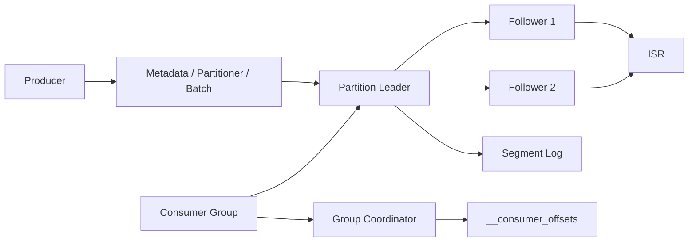
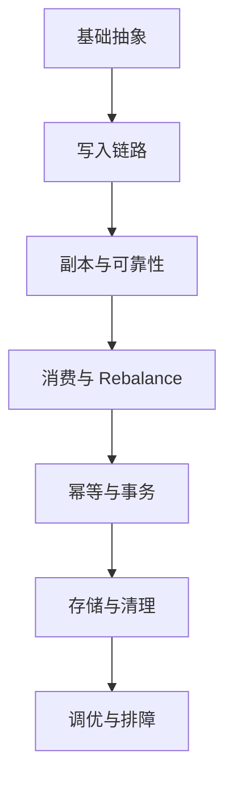
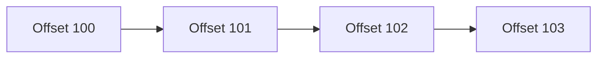
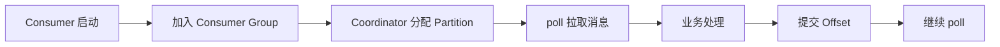
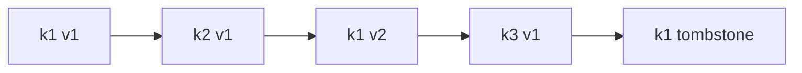
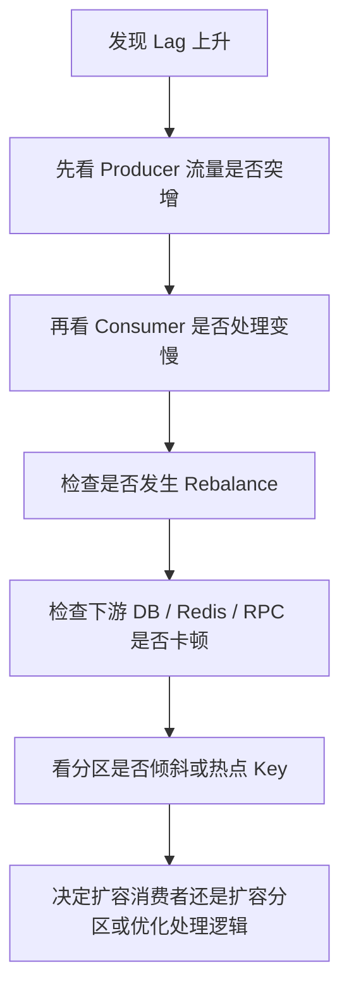

# Kafka

## Kafka 全链路总览



面试里最推荐的一句话是：

```text
Kafka 本质上是分布式追加日志系统。生产者按分区把消息顺序写入 Leader，Follower 同步形成副本集合，消费者组按分区并行拉取并通过 Offset 维护消费进度。
```

## Kafka 学习路线



## Kafka 基础入门

### 1. Kafka 是什么

Kafka 本质上是一个 `分布式事件流平台`，也可以把它理解成“高吞吐、可持久化、可扩展的分布式消息系统”。

它最常见的业务价值有 4 个：

- `异步解耦`：把同步调用链路改造成事件驱动链路
- `削峰填谷`：把瞬时流量先写入 Kafka，再让下游按自己的处理能力消费
- `流式处理`：用于日志、埋点、监控、行为事件等连续数据处理
- `最终一致`：通过事件通知驱动多个系统逐步完成状态变更

一句话表达：

```text
Kafka 的核心定位是高吞吐的分布式追加日志系统，靠分区扩展吞吐，靠副本保障可用，靠消费者组支撑并行消费。
```

### 2. 核心概念

- `Producer`：消息生产者，负责发消息
- `Consumer`：消息消费者，负责拉取并处理消息
- `Broker`：Kafka 服务节点，负责消息存储和读取
- `Topic`：逻辑主题，用来做消息分类
- `Partition`：Topic 下的分区，是 Kafka 并行读写和扩容的基本单元
- `Offset`：分区内消息位移，用来标识消费进度
- `Replica`：分区副本，用于高可用
- `Leader`：处理读写请求的主副本
- `Follower`：同步 Leader 数据的从副本
- `ISR`：与 Leader 保持同步的副本集合
- `Consumer Group`：消费者组，同组内多个消费者分摊不同分区

可以这样记：

```text
Producer -> Topic -> Partition -> Consumer Group
                    |
                Leader / Follower
```

### 3. Topic 和 Partition 的关系

- `Topic` 是逻辑分类，不直接等于并发能力
- `Partition` 才是消息真正落盘、并行消费和水平扩展的基础
- 一个 Topic 可以有多个 Partition
- 同一个 Partition 内消息有序
- 多个 Partition 之间天然无全局顺序

面试里最好直接说清这句：

```text
Kafka 只能保证单分区内有序，不能天然保证多分区全局有序；如果要保证同一业务键有序，通常要把同 key 的消息路由到同一分区。
```

### 4. Kafka 为什么吞吐高

Kafka 高吞吐通常来自这些设计：

- `顺序追加写`：磁盘顺序写性能远高于随机写
- `PageCache`：充分利用操作系统页缓存减少磁盘抖动
- `分区并行`：多个分区支持并发读写
- `批量发送`：生产者通过 batch 降低网络开销
- `压缩`：减少网络和磁盘占用
- `零拷贝`：读取消息时减少用户态和内核态之间的数据搬运

标准面试回答可以概括为：

```text
Kafka 快的核心不是“完全不落盘”，而是把消息写入做成顺序追加，再结合 PageCache、批量发送、压缩和零拷贝，把磁盘和网络成本都压低了。
```

### 5. 副本、Leader、ISR 是什么

- 每个 Partition 可以配置多个副本
- `Leader` 负责对外提供读写
- `Follower` 负责从 Leader 拉取数据并同步
- `ISR` 是当前和 Leader 保持同步的副本集合
- 生产者常说的可靠性，本质上和 `acks`、副本同步、ISR 状态密切相关

这道题一定要能顺口说出来：

```text
Kafka 不是所有副本都实时强一致，而是通过 ISR 维护“当前可认为同步可靠”的副本集合。高可用和数据可靠性，很多时候就是围绕 ISR 展开的。
```

### 6. acks 怎么理解

- `acks=0`：生产者发出后不等确认，吞吐最高，可靠性最差
- `acks=1`：Leader 写本地日志后返回成功，若 Leader 立即故障可能丢消息
- `acks=all`：等待所有 ISR 副本确认后返回，可靠性最高

工程上常见结论：

- 要更高可靠性，常用 `acks=all`
- 只配 `acks=all` 还不够，通常还要结合 `min.insync.replicas`
- 高可靠并不等于绝对不丢，还要看副本数、ISR、Broker 故障场景和业务补偿

### 7. 消费者组和 Rebalance

- 一个分区在同一个消费组内，同一时刻只能被一个消费者消费
- 消费者数量大于分区数时，多出来的消费者会空闲
- 消费者上下线、分区数变化、订阅关系变化，都可能触发 `Rebalance`
- Rebalance 会导致分区重新分配，处理不当会带来暂停、抖动和堆积

面试高频一句话：

```text
Kafka 的并行消费能力由“分区数”决定，不是由消费者实例数无限决定；消费者再多，如果分区不够，也不会提升吞吐。
```

### 8. Offset 是什么，为什么重要

- `Offset` 是分区内消息的位置标识
- 消费者通过提交 Offset 记录自己处理到哪里
- Kafka 的消费进度管理，本质上就是 Offset 管理
- 自动提交简单但可控性弱
- 手动提交更常见，便于和业务处理结果绑定

要能答出这层区别：

```text
消息被拉到消费者，不代表业务已经处理成功；真正决定“是否会重复消费或丢消息”的关键之一，是 Offset 提交时机。
```

### 9. Kafka 的消费语义

- `At most once`：先提交 Offset 再处理，可能丢消息，但一般不会重复
- `At least once`：先处理再提交 Offset，通常不会丢，但可能重复
- `Exactly once`：依赖幂等生产、事务能力以及消费处理链路配合，不是默认天然获得

更稳妥的表达是：

```text
Kafka 默认更容易实现的是至少一次语义；如果要做到接近精确一次，通常需要生产端幂等或事务、消费端幂等、Offset 提交和业务写入协同设计。
```

### 10. 幂等生产者和事务消息

- 幂等生产者用于解决重试导致的重复写入问题
- 事务用于保证跨多个分区或多个写操作的原子提交
- 幂等解决的是“重复写”
- 事务解决的是“要么全成，要么全不成”

很容易被追问的点：

```text
Kafka 的 Exactly Once 更偏消息系统语义，不等于你的整个业务链路天然 Exactly Once。下游数据库、缓存、接口调用，仍然需要业务幂等和补偿。
```

### 11. Kafka 能不能保证不丢、不重、不乱

这题建议拆开答：

- `不丢`：生产端要结合 `acks=all`、副本机制、ISR、重试；消费端要控制 Offset 提交时机
- `不重`：Kafka 很多场景只能做到“可能重复但尽量不丢”，业务侧仍要幂等
- `不乱`：只能保证单分区有序；跨分区不能天然保证全局顺序

标准总结：

```text
Kafka 更擅长提供“高吞吐 + 高可用 + 至少一次”的工程能力，业务上的绝对不丢、不重、不乱，通常都需要你自己额外设计。
```

## Kafka 架构总览

### 1. Kafka 集群由哪些角色组成

- `Broker`：真正负责存储消息和提供读写服务
- `Controller`：负责分区 Leader 选举、集群元数据管理和副本状态协调
- `Producer`：发送消息
- `Consumer`：拉取消息
- `Group Coordinator`：负责消费组成员管理和分区分配

当前官方新架构以 `KRaft` 为主，也就是 Kafka 自己负责元数据管理；但很多老项目和面试题仍然会问 `ZooKeeper` 时代的架构。

所以更稳妥的表达是：

```text
新版本官方架构以 KRaft 为主，老系统可能仍是 ZooKeeper；但不管底层元数据由谁管理，面试里最核心的仍然是分区、副本、ISR、Leader 切换和消费组机制。
```

### 2. Topic、Partition、Replica 的关系

- `Topic` 负责逻辑分类
- `Partition` 负责并行度和扩展能力
- `Replica` 负责高可用

一个 Topic 可以有多个 Partition，一个 Partition 可以有多个 Replica。

最容易记混的地方是：

- 扩吞吐主要看 `Partition`
- 保高可用主要看 `Replica`
- 单分区内有序，多分区天然不保证全局有序

## Kafka 存储模型

### 1. Kafka 为什么本质上像日志系统

Kafka 的消息不是“随机插入”，而是追加到分区日志末尾。

每个 Partition 都可以理解成一个持续追加的日志文件：



这种设计带来的好处是：

- 顺序写磁盘，吞吐高
- 数据天然有位移顺序，便于消费进度管理
- 分区是天然的水平扩展和并行处理单位

### 2. Segment 是什么

- 一个 Partition 不会只对应一个无限大的文件
- Kafka 会把一个 Partition 拆成多个 `Segment`
- 每个 Segment 通常会配套索引文件

可以这样理解：

```text
Partition 是逻辑日志，Segment 是物理分段文件。
```

### 3. Offset、LEO、HW 分别是什么

- `Offset`：消息在分区内的位置编号
- `LEO`：日志末端位移，表示当前已经写到哪里
- `HW`：高水位，通常表示当前对消费者可见、已提交的安全位置

面试里容易被追问：

```text
Producer 写成功不等于消费者立刻可见；消费者通常只能读到 HW 以内的数据。
```

### 4. Index 为什么重要

Kafka 不会每次都顺序扫描整个日志来找消息，而是通过索引辅助定位。

你只要先记住这层就够了：

- 日志文件存消息本体
- 索引文件帮助快速定位 offset 附近的数据
- 时间索引帮助按时间查找

## Producer 发送全流程

### 1. 发送链路图


### 2. Producer 到底做了哪些事

生产者不是简单地“把一条消息扔出去”，通常至少会经过下面几步：

1. 拉取 Topic 元数据
2. 选择目标 Partition
3. 把消息写入内存缓冲
4. 聚合成 Batch
5. 按配置进行压缩
6. 发送给目标 Partition 的 Leader
7. 等待副本同步达到确认条件
8. 返回成功、失败或触发重试

### 3. 分区路由规则怎么理解

常见分区路由方式有三种：

- 指定 Partition：业务自己控制路由
- 按 Key 路由：同一个 Key 通常会落到同一 Partition
- 无 Key 轮询或粘性分区：用于更均衡地打散流量

如果面试官问“如何保证订单号有序”，你最好直接答：

```text
让同一个订单或同一个业务主键始终路由到同一个 Partition，这样只能保证该业务键在单分区内有序，不能保证全局有序。
```

### 4. Producer 为什么能做高吞吐

- `Batch`：多条消息合并发送，减少网络开销
- `linger.ms`：允许短暂等待以聚合更多消息
- `compression.type`：压缩降低网络和磁盘成本
- `buffer.memory`：发送前先在客户端缓冲
- 异步发送模型减少业务线程阻塞

## Kafka 可靠性专题

### 1. acks、ISR、min.insync.replicas 到底是什么关系

- `acks` 决定生产者发消息时要等到什么程度才算成功
- `ISR` 是当前跟上 Leader 的副本集合
- `min.insync.replicas` 决定最少要有多少个 ISR 副本在线，才允许某些高可靠写入成功

这三者的关系可以这样背：

```text
acks 决定“怎么等确认”，ISR 决定“哪些副本算有效确认”，min.insync.replicas 决定“至少要多少个有效副本在线”。
```

### 2. 为什么 acks=all 仍然可能丢消息

这是标准一面的高频追问，建议你至少答出下面几个点：

1. `min.insync.replicas` 配得太低

- 如果副本数是 3，但 `min.insync.replicas=1`
- 某些时刻 ISR 里可能只剩 Leader 一个副本
- 这时 `acks=all` 实际上退化成“只要 Leader 自己确认即可”

1. 开启了 `unclean leader election`

- 如果允许从落后的副本里强行选 Leader
- 新 Leader 可能没有旧 Leader 上已经确认过的数据
- 就会出现已确认消息回退或丢失

1. Producer 收到的是“结果不确定”

- 例如 Broker 已经写成功，但响应在网络中丢失
- 生产者会认为超时并重试
- 这时如果没有幂等，可能出现重复；如果应用直接判失败，也会出现“业务视角的丢失”

1. 只保证 Kafka 内部可靠，不保证业务端到端可靠

- Kafka 写成功了，但业务侧在“落库、回调、状态推进”阶段失败
- 用户会觉得“消息丢了”，本质上是链路后半段没处理好

### 3. 最稳妥的高可靠配置思路

```properties
acks=all
enable.idempotence=true
retries=较大值
max.in.flight.requests.per.connection=5 或更谨慎
```

Broker 侧通常还会配合：

```properties
min.insync.replicas=2
unclean.leader.election.enable=false
```

一句话总结：

```text
想把“消息可靠写入”做稳，不能只盯着 acks=all，还要同时看副本数、ISR、min.insync.replicas、Leader 选举策略和 Producer 幂等。
```

## Consumer 消费全流程

### 1. 消费链路图



### 2. Consumer Group 为什么重要

- 同一个消费组内，一个 Partition 同一时刻只能分给一个消费者
- 所以消费并行度上限通常由 `Partition 数` 决定
- 如果消费者实例比分区多，多出来的消费者会空闲

这道题最好直接答：

```text
Kafka 的消费并发能力并不是消费者越多越高，而是由分区数上限控制；消费者组只是把分区分摊给不同消费者。
```

### 3. Coordinator 和 \_\_consumer\_offsets 是什么

- `Coordinator` 负责管理消费组成员、Rebalance、Offset 提交
- `__consumer_offsets` 是 Kafka 内部 Topic，用来保存消费组的进度信息

面试里可以这样说：

```text
Kafka 的消费进度不是存在消费者本地，而是通常存储在 Kafka 内部的 __consumer_offsets 中，由 Coordinator 协调管理。
```

### 4. poll 模型怎么理解

Kafka 消费本质上还是“拉模型”：

- Consumer 调用 `poll`
- Broker 返回一批消息
- 应用处理消息
- 再决定何时提交 Offset

所以所谓“实时消费”，本质上是高频 poll 的结果。

## Rebalance 专题

### 1. 什么情况下会触发 Rebalance

- 新消费者加入组
- 老消费者退出组
- Topic 分区数发生变化
- 订阅关系发生变化

### 2. Rebalance 为什么麻烦

因为 Rebalance 期间往往意味着：

- 分区重新分配
- 某些消费者短暂停止处理
- 如果处理时间长或提交时机不对，容易带来重复消费和积压抖动

### 3. 如何减少 Rebalance 带来的影响

- 控制单条消息处理时长，避免长时间阻塞 `poll`
- 合理设置 `max.poll.interval.ms`
- 不要把过重的业务逻辑直接堵在消费线程里
- 消费端处理尽量做到幂等
- 分区数规划要合理，减少频繁扩缩容带来的抖动

## Offset 提交策略

### 1. 自动提交和手动提交的区别

- `enable.auto.commit=true`
  - 优点：简单
  - 缺点：容易出现“消息还没处理完，Offset 已经提交”
- 手动提交
  - 优点：更可控，能和业务处理结果绑定
  - 缺点：代码复杂度更高

### 2. 为什么 Offset 提交时机会影响丢失和重复

这点非常关键：

- `先提交后处理`：可能丢消息
- `先处理后提交`：可能重复消费

面试里的标准表达：

```text
Kafka 很多时候不是在“丢和不丢”之间选择，而是在“少丢但可能重”和“少重但可能丢”之间做工程权衡，所以消费端幂等几乎是默认必备能力。
```

### 3. 业务里更常见的提交策略

更常见的工程实践是：

1. poll 拉一批消息
2. 业务处理成功
3. 再提交这一批对应的 Offset

如果你还要答深一点，可以补一句：

```text
如果消费后还要写数据库，通常要把“业务落库成功”和“Offset 提交成功”一起考虑，否则会出现重复写或丢处理结果的问题。
```

## 顺序性专题

### 1. Kafka 到底能保证什么顺序

- 单个 Partition 内，消息天然按 Offset 有序
- 多个 Partition 之间，不保证全局顺序

### 2. 业务里怎么保证局部顺序

最常见的方法是：

- 以订单号、用户 ID、设备 ID 作为 Key
- 保证相同 Key 路由到同一 Partition

### 3. 为什么开启重试后还可能乱序

如果没有幂等保护，且并发发送较高：

- 前一条消息失败重试
- 后一条消息先成功
- 就可能出现写入顺序和业务期望顺序不一致

所以要注意：

- 开启幂等生产者
- 关注 `max.in.flight.requests.per.connection`
- 顺序要求强时，不要只说“Kafka 天然有序”

## 幂等、重试与重复消费

### 1. Producer 侧为什么需要幂等

因为网络抖动、Broker 超时、响应丢失时，Producer 往往会重试。

如果没有幂等，重试可能导致：

- 同一条消息在 Broker 里写入多次
- 下游业务重复触发

### 2. Consumer 侧为什么仍然要幂等

即使生产端幂等了，消费端仍然可能因为：

- 处理成功但 Offset 没提交
- Rebalance 导致分区转移
- 消费进程异常退出

而再次消费同一条消息。

所以消费端常见幂等方案有：

- 业务唯一键去重
- 数据库唯一索引
- 状态机判重
- 去重表 / 幂等表
- Redis 幂等键

### 3. 一个非常实用的面试表达

```text
Kafka 的幂等不是只做一端就够了。生产端幂等解决重复写入 Broker，消费端幂等解决重复执行业务，两者解决的是不同层面的问题。
```

## 事务与 Exactly Once

### 1. Kafka 事务解决什么问题

Kafka 事务主要解决的是：

- 多条消息写入多个 Partition 时的原子性
- 消费后生产场景下的“读-处理-写”一致性

### 2. 想做 EOS 通常要哪些条件

- Producer 开启幂等
- 配置 `transactional.id`
- Consumer 侧配合 `read_committed`
- 必要时把消费位移和生产结果纳入同一事务语义

### 3. 面试里最容易答错的地方

不要把 `Exactly Once` 说成：

```text
Kafka 开个事务，就能保证整个业务链路绝对只执行一次。
```

更准确的说法是：

```text
Kafka 的 EOS 主要是消息系统内部以及消费后再生产这类链路的精确一次语义，到了数据库、缓存、RPC 等外部系统，仍然要靠业务幂等和补偿保证最终正确。
```

## Retention 与 Log Compaction

### 1. 两种常见清理策略

- `delete`：保留一段时间或一定大小后删除旧数据
- `compact`：按 Key 保留最新值，旧值被压缩清理

### 2. 什么场景适合 Compact

适合“我更关心某个 Key 的最新状态，而不是全量历史”的场景，比如：

- 用户最新资料
- 配置最新值
- 维表、快照流

### 3. Compaction 流程图



压缩后的逻辑结果通常会更接近：

- `k2 -> v1`
- `k3 -> v1`
- `k1 -> 删除或等待墓碑清理`

### 4. Tombstone 是什么

在 Compact Topic 里，删除某个 Key 常常不是立刻物理删除，而是写入一个值为 `null` 的墓碑消息，后续再由压缩流程清理。

## Kafka 性能调优

### 1. Producer 侧重点

- 合理设置 `batch.size`
- 合理设置 `linger.ms`
- 开启压缩
- 控制发送端单条消息大小
- 避免过多小消息

### 2. Broker 侧重点

- 分区数不要失控
- 副本数和机器资源要平衡
- 磁盘要关注顺序写能力和 IO 饱和
- 网络带宽是高吞吐场景的核心瓶颈之一

### 3. Consumer 侧重点

- `max.poll.records` 控制单批拉取量
- 处理线程和消费线程分离
- 避免单条消息处理过慢
- 根据积压情况扩容消费者或增加分区

### 4. 分区数是不是越多越好

不是。

分区数过多会带来：

- 元数据膨胀
- Rebalance 成本提升
- 文件句柄和内存占用增加
- 运维复杂度上升

所以更准确的结论是：

```text
分区数应该围绕目标吞吐、并发消费能力、单分区负载和未来扩容空间来规划，而不是越多越好。
```

## 线上排障与治理

### 1. 消息积压怎么排查



### 2. 积压常见根因

- 下游数据库或 RPC 变慢
- 某个热点 Key 导致分区倾斜
- Rebalance 频繁发生
- 单条消息处理太重
- 消费线程模型设计不合理

### 3. 出现重复消费怎么排查

- 先看 Offset 提交时机
- 再看消费者是否重启或 Rebalance
- 再看业务幂等是否缺失
- 最后看是不是生产端重试引起的重复写入

### 4. 出现乱序怎么排查

- 看同一业务键是否真的进了同一 Partition
- 看 Producer 重试和并发发送设置
- 看消费端是否把单分区消息并行乱了

### 5. 出现“消息丢了”怎么排查

要按链路拆：

1. Producer 是否真正发送成功
2. Broker 是否确认成功
3. 消息是否被错误地认为已消费
4. Consumer 是否处理失败但已提交 Offset
5. 业务下游是否执行失败但没有补偿

## Kafka 常见业务场景

### 1. 异步解耦

典型链路：

```text
订单创建 -> 发 Kafka 事件 -> 库存服务 / 营销服务 / 通知服务分别消费
```

### 2. 削峰填谷

适合：

- 秒杀
- 日志上报
- 大批量导入
- 突发任务投递

### 3. 日志采集与埋点流

Kafka 非常适合承接：

- 应用日志
- 用户行为埋点
- 监控指标流
- CDC 变更流

### 4. 最终一致

常见思路是：

- 业务主操作成功
- 写事件或写 Outbox
- Kafka 驱动其他系统异步消费
- 通过幂等、重试、补偿实现最终一致

## Kafka 面试高频问答清单

如果你准备标准一面，下面这些题几乎都值得反复练：

1. Kafka 为什么吞吐高
2. Topic 和 Partition 有什么区别
3. Kafka 怎么保证高可用
4. ISR 是什么，为什么不等于全部副本
5. acks=all 为什么仍可能丢消息
6. min.insync.replicas 有什么作用
7. Kafka 怎么保证消息顺序
8. Kafka 能不能保证不重复消费
9. 自动提交和手动提交有什么区别
10. Rebalance 什么时候发生，为什么会影响消费
11. 为什么会出现消息积压，怎么排查
12. 幂等生产者解决什么问题
13. Kafka 事务解决什么问题
14. Log Compaction 适合什么场景
15. 分区数如何规划

## Kafka 一页纸速记

```text
1. Topic 是逻辑分类，Partition 是并发与扩容单元，Replica 是高可用单元。
2. 单分区内有序，多分区无全局顺序。
3. 高吞吐来自顺序写、PageCache、Batch、压缩、零拷贝。
4. 可靠性要同时看 acks、ISR、min.insync.replicas、Leader 选举、幂等。
5. 消费并发上限由分区数决定，不是消费者数决定。
6. Rebalance 会带来抖动，长耗时处理和错误提交 Offset 都会放大问题。
7. Kafka 默认更容易做到至少一次，业务侧必须重视幂等。
8. Kafka 事务不等于整个业务链路天然精确一次。
9. 积压排查先看流量，再看消费能力，再看下游瓶颈和分区倾斜。
10. 面试答 Kafka，最好永远沿着“写入 -> 副本 -> 消费 -> 提交 -> 幂等 -> 排障”这条链说。
```

